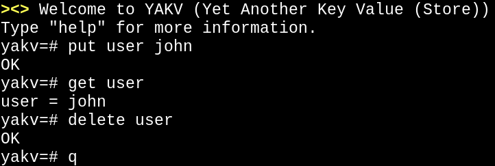

# yakv

```
yakv ><>
```



yakv (yet another key value store) is a key value store with a dead simple
interface: `put` to store data, `get` to retrieve it, and `delete` to
remove it. That's it.

---

[Read the YAKV Blog](https://erichayter.com/yakv-blog/) - Learn about the internals, design decisions, and database implementation details behind YAKV.

---

Start the server:
```shell
./bin/server
```

In another terminal, connect with the shell:
```shell
./bin/client
```

Then run some commands:
```
yakv=# put mykey myvalue
OK
yakv=# get mykey
mykey = myvalue
yakv=# delete mykey
OK
yakv=# quit
```

## Building

You'll need `protoc` installed for the protocol buffers. Then just run:

```shell
make
```

## Goal

The main goal of this project is to explore database concepts in a smaller, more
experimental repo that may or may not make it into my main database project:
[yadb](https://github.com/EricHayter/yadb). Primarily, this project will
focus on the storage backend of databases (concurrency control, LSM, etc...),
hence the overly simplistic querying interface.

The original scope was to implement a basic KV store with a log-based storage
engine, in particular an LSM backend taking inspiration from
[RocksDB](https://github.com/facebook/rocksdb) and
[Pebble](https://github.com/cockroachdb/pebble).

Also, this project serves to see how database development feels with Go.
Increasingly it seems like Go is becoming a popular choice in database
development with notable databases including
[CockroachDB](https://github.com/cockroachdb/cockroach) and
[Weaviate](https://github.com/weaviate/weaviate), so I
wanted to see what the fuss was all about.

## Roadmap/Things I want to try out

- [ ] Finish implementing LSM
    - [x] Implement skiplist (for memtable)
    - [x] Implement buffer manager
    - [x] Implement disk manager
    - [x] Implement storage manager
    - [ ] Implement SS tables / merging algos
- [ ] Implement a write ahead log (WAL) / get eventual durability implemented
- [ ] Raft consensus algorithm / make it distributed
