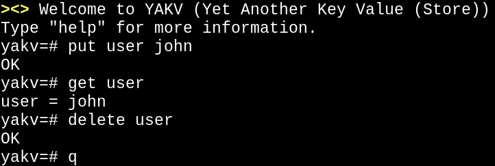
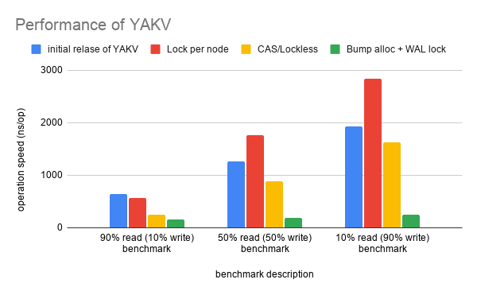

# yakv

```
yakv ><>
```



yakv (yet another key value store) is a key value store with a dead simple
interface: `put` to store data, `get` to retrieve it, and `delete` to
remove it. That's it.

---

[Read the YAKV Blog](https://erichayter.com/yakv-blog/) - Learn about the internals, design decisions, and database implementation details behind YAKV.

---

Start the server:
```shell
./bin/server
```

In another terminal, connect with the shell:
```shell
./bin/client
```

Then run some commands:
```
yakv=# put mykey myvalue
OK
yakv=# get mykey
mykey = myvalue
yakv=# delete mykey
OK
yakv=# quit
```

## Building

You'll need `protoc` installed for the protocol buffers. Then just run:

```shell
make
```

## Performance

Since the initial working version of YAKV, I'm going to run the same following
benchmarks to track changes in performance to monitor the effect of
optimizations that I'm going to try.

Benchmarks for concurrent mixed workloads (per-core goroutines), on Intel(R) Core(TM) Ultra 7 265K:



Run benchmarks yourself:
```shell
go test -bench=BenchmarkConcurrentMixed -benchmem ./server/lsm
```

### Optimization history

**`87c6733` — LSM-level coarse locking** *(2026-04-15)*

Initial thread-safe implementation. Read and write operations on the skiplist
were serialized with a single read-write mutex at the LSM layer. All concurrent
writers queued behind a global exclusive lock.

**`28375e0` — Per-node locking in skiplist** *(2026-04-23)*

Moved the lock from the LSM layer down into the skiplist itself, using a mutex
per node rather than one global lock. The insert commit phase only locks the
predecessor nodes that need updating, allowing concurrent inserts into different
regions of the list to proceed in parallel.

**`289edbd` — Fix deadlock in per-node locking** *(2026-05-16)*

Two concurrent inserts with overlapping predecessor sets could deadlock if they
acquired the same locks in opposite order. Fixed by always locking predecessor
nodes from highest level to lowest (head-side first), guaranteeing a consistent
global lock ordering.

**`bd90569` — Atomic pointers for skiplist next pointers** *(2026-05-16)*

Replaced raw pointers with `atomic.Pointer` for all `next` fields and node
values. This made `Get` and `Items` fully lock-free — reads no longer take any
lock and can run concurrently with writes without blocking.

**`0e978c6` — CAS-based lock-free insert** *(2026-05-16)*

Removed the per-node mutex from `skipListNode` entirely. Insert now uses
compare-and-swap: level 0 is the commit point (one CAS makes the node logically
present), and higher levels are linked independently with their own CAS loops.
A failed CAS at any level just re-finds the predecessor and retries that level —
no global or per-node locks are held at any point during an insert.

**`465daad` — Bump allocator for skiplist nodes** *(2026-06-15)*

Replaced per-node heap allocation with a bump allocator, carving nodes out of
larger pre-allocated arenas. This cuts allocation overhead and pointer-chasing
on the insert path.

**`7d66e0a` — Improved WAL locking scheme** *(2026-06-15)*

Loosened the lock held around the write-ahead log so that writers no longer
serialize on it for the full append. Combined with the bump allocator, this is
what drives the large gains on write-heavy workloads.

| Workload | global mutex (4 threads) | per-node mutex (per-core) | CAS (per-core) | CAS + bump alloc & WAL lock (per-core) |
|---|---|---|---|---|
| 90% read / 10% write | 648 ns/op | 565 ns/op | 247 ns/op | **160 ns/op** |
| 50% read / 50% write | 1256 ns/op | 1762 ns/op | 892 ns/op | **194 ns/op** |
| 10% read / 90% write | 1933 ns/op | 2843 ns/op | 1626 ns/op | **248 ns/op** |

## Goal

The main goal of this project is to explore database concepts in a smaller, more
experimental repo that may or may not make it into my main database project:
[yadb](https://github.com/EricHayter/yadb). Primarily, this project will
focus on the storage backend of databases (concurrency control, LSM, etc...),
hence the overly simplistic querying interface.

The original scope was to implement a basic KV store with a log-based storage
engine, in particular an LSM backend taking inspiration from
[RocksDB](https://github.com/facebook/rocksdb) and
[Pebble](https://github.com/cockroachdb/pebble).

Also, this project serves to see how database development feels with Go.
Increasingly it seems like Go is becoming a popular choice in database
development with notable databases including
[CockroachDB](https://github.com/cockroachdb/cockroach) and
[Weaviate](https://github.com/weaviate/weaviate), so I
wanted to see what the fuss was all about.

