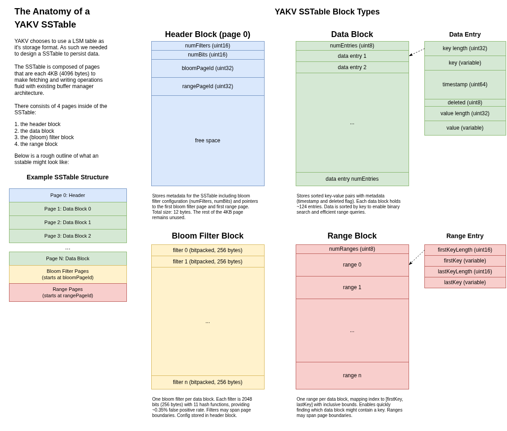

# SSTable

YAKV uses an LSM for the storage engine. We've designed our own SSTable file
format for the LSM implementation. The SSTable files are page-based in order
to make handling with the buffer manager easier.

## SSTable Format Diagram



For the editable diagram source, see [sstable_format.drawio](../../../docs/sstable_format.drawio).

# Block Types

The SSTable contains 4 different types of blocks:

1. Header Block (Page 0): Metadata tracking block containing:
   - Total number of entries in the entire SSTable
   - Bloom filter configuration parameters (number of bits, number of hash functions)
   - Page number offsets to the first bloom filter and range blocks (since they're not at fixed positions)
   - Global range (first and last keys in the entire SSTable)
   - Fixed-size portion: 16 bytes, variable-size: globalFirstKey + globalLastKey
     - `numTuples` (4 bytes) - total number of entries
     - `numFilters` (2 bytes)
     - `numBits` (2 bytes)
     - `bloomPageId` (4 bytes)
     - `rangePageId` (4 bytes)
     - `globalFirstKeyLen` (2 bytes)
     - `globalLastKeyLen` (2 bytes)
     - `globalFirstKey` (variable bytes)
     - `globalLastKey` (variable bytes)

2. Data Blocks (Pages 1 to N): Main data storage containing key-value pairs from the memtable with metadata:
   - Byte 0: `numTuples` (1 byte) - count of entries in this block
   - Followed by entries, each containing:
     - `timestamp` (8 bytes) - entry timestamp
     - `deleted` (1 byte) - tombstone flag (0 = alive, 1 = deleted)
     - `keyLen` (4 bytes) - length of key
     - `valueLen` (4 bytes) - length of value
     - `key` (variable bytes)
     - `value` (variable bytes)
   - Minimum entry size: 17 + keyLen + valueLen bytes
   - Keys and values serialized as length-value pairs
   - Data is sorted by key within and across blocks

3. Bloom Filter Blocks: Per-block bloom filters for fast existence checks.
   These filter blocks in theory will reduce the amount of page loads by
   condensing the information of each data block into a bloom filter stating
   whether or not a given key is in a data block.
   - Bloom filters written sequentially in order of data blocks
   - Each filter follows the configuration specified in the header
   - All filters are the same size (numBits / 8 bytes)
   - No per-filter metadata stored (reduces overhead)
   - Filters may span page boundaries
   - Configuration: 2048 bits = 256 bytes per filter, 11 hash functions
   - 16:1 ratio of data blocks to filter blocks

4. Range Blocks: Key range index for each data block. Similar idea as the bloom
   filter blocks, these just give another layer of defense against needlessly
   reading undesired pages into the buffer manager. Also will be helpful when
   merging SSTables as we would ideally like to have their ranges be minimized.
   - Byte 0: `numRanges` (1 byte) - count of ranges in this page
   - Followed by range entries, each containing:
     - `firstKeyLen` (2 bytes)
     - `lastKeyLen` (2 bytes)
     - `firstKey` (variable bytes)
     - `lastKey` (variable bytes)
   - Ranges use inclusive bounds: [firstKey, lastKey]
   - Combined with bloom filters, provides high-probability estimation of key presence without false positives from range checks alone
   - Ranges may span page boundaries

## Bloom Filter Parameters

This is summary of the analysis done to determine a decent choice of bloom
filter configuration in SSTables. The full, more lengthy analysis can be found
in the `sstable_writer.go` file.

Also many of the formulae used originate from:
https://en.wikipedia.org/wiki/Bloom_filter

The above was found to be very useful during this analysis.

### Capacity Calculation

With 4096-byte pages and entries having 17 + m + n bytes (where m = key length, n = value length):
- Assuming 8-byte keys and 8-byte values (e.g., 64-bit IDs)
- Entry size: 17 + 8 + 8 = 33 bytes
- Entries per block: 4096 / 33 ≈ 124 entries per page

### Bit Size Selection

Using the formula for desired false positive rate E:
```
m = -2.08 * ln(E) * n
```
Where:
- m = number of bits
- E = desired false positive rate
- n = number of elements (124 entries)

False positive rates for different bit counts:
- 1%: ~1187 bits (148 bytes)
- 5%: ~772 bits (97 bytes)

Chosen size: 256 bytes (2048 bits)
- Power of 2 for alignment and zero fragmentation
- Expected false positive rate: 0.35% (with ideal hashing)
- 16:1 ratio of data blocks to filter blocks

### Hash Function Count

Optimal number of hash functions:
```
k = (m / n) * ln(2)
```
Where:
- m = 2048 bits
- n = 124 entries

Result: 11 hash functions

This configuration assumes entry counts close to the predicted 124 entries per page and errs on the side of caution for acceptable false positive rates in real-world scenarios.
